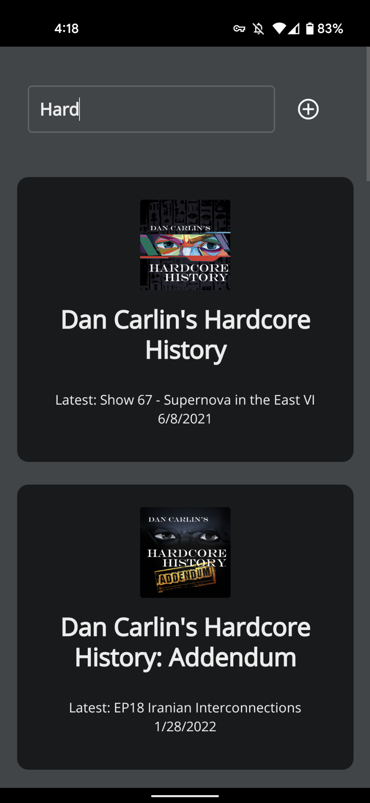
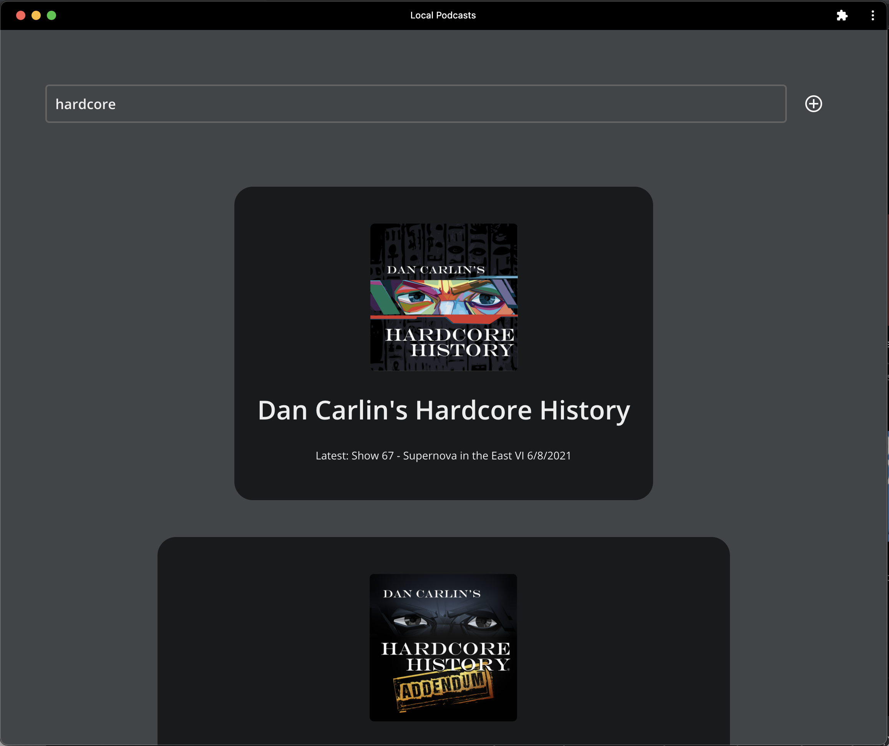

# Local Podcasts

A fully self hosted podcast manager.  Download & save the full history of a podcast on a local server for fast access & play with the Local Podcasts PWA.  This does not currently save podcasts to your device but only saves podcasts on the local server, so will not provide offline / remote access when not on your home network.

# Installation

## Docker
```bash
docker run -p 8080:8080 -v <path to podcast storage directory>:/data ghcr.io/nathanamorin/local-podcasts:<latest release tag here>
```

## Kubernetes
Modify the included Kuberntes manifests ```deployment/deployment.yaml``` to match your environment.
```bash
kubectl apply -f deployment/deployment.yaml
```

Mobile

Desktop

